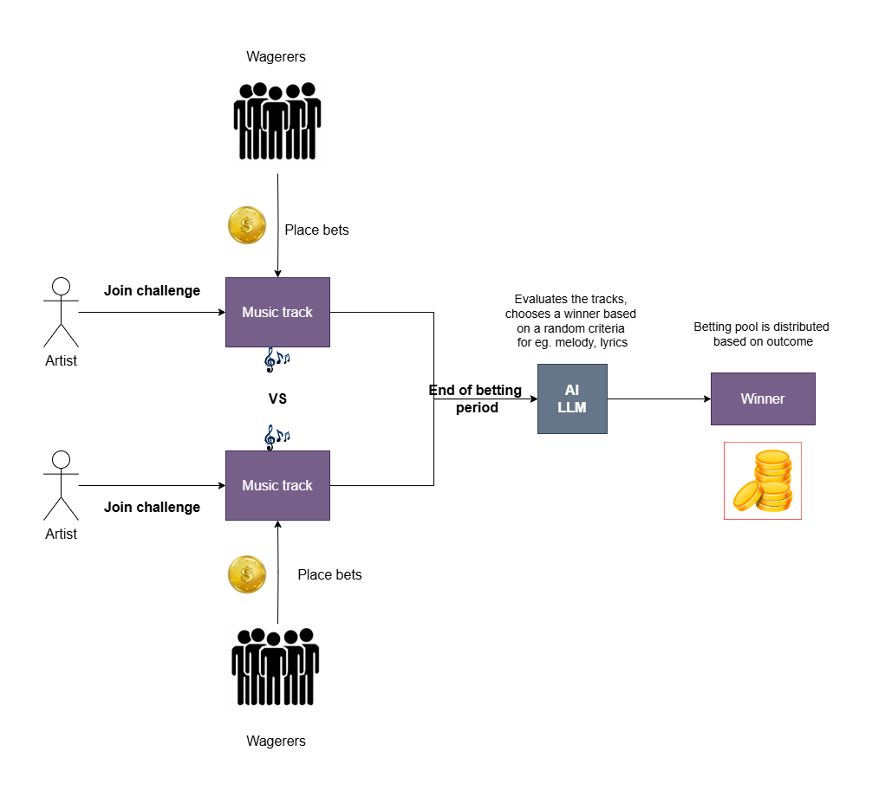

# Actia

A crypto platform for PVP (Player vs. Player) music battles, where users can wager on outcomes through an opinion-based prediction market, similar to Polymarket. The platform allows up-and-coming artists to showcase their talent in competitive, real-time music battles, while giving the community the chance to predict the winners and participate in the outcome through staking or betting. This unique fusion of music and blockchain creates a vibrant, engaging space for fans and artists alike, offering visibility for low-key talent, revenue generation, and community involvement. Actia leverages crypto and decentralized finance (DeFi) to revolutionize music discovery, monetization, and fan interaction.

 

  

